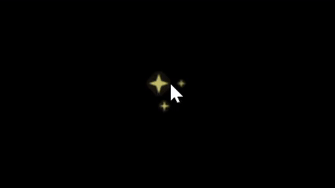
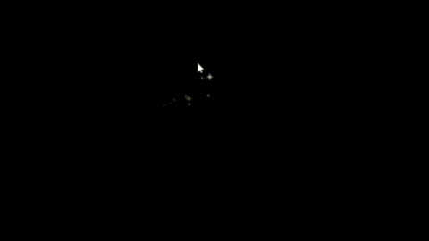
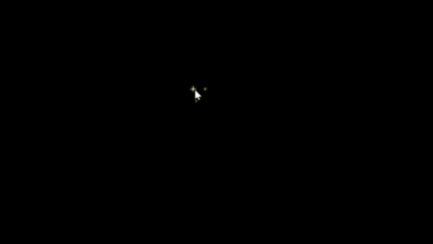

This repository is for visual effects for websites using JavaScript.

Both effects are themed around stars, the first being stars that stay around the cursor and twinkle, when the second is a trail of stars that are left behind by the cursor.

Below is what the star cursor effect looks like in action:

This is what the star trail looks like in action:

Here is both effects in use:

